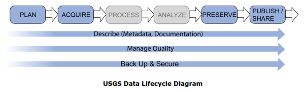

  

## Formal data management lifecycles

In the first week, I introduce a **generic data analytics** pipeline \(shown below\) outlining the main tasks that occur in a data\-driven project. 

_Figure 1: A Generic Data Analytics Pipeline_&nbsp;

However there are many formal data management systems used in different domains. Let’s look at a few examples:

<!---->
- A research data management lifecycle

- Domain example: US Geological Survey Data lifecycle

- Enterprise Data Management

- Data mining: CRISP\-DM

At the end of this document are some questions for you to reflect on and discuss.

### A research data management lifecycle: UK Data Service

A key component of **data\-driven research** \(whether in sociology, economics, medicine or artificial intelligence\) is the data process. The UK data service has lots of materials to support research projects in effectively managing their data available [here](https://www.ukdataservice.ac.uk/manage-data/lifecycle.aspx). 

Watch the video at [https://youtu.be/\-wjFMMQD3UA](https://youtu.be/-wjFMMQD3UA) \(it has no sound\) to explore this data management lifecycle. 

_Figure 2: UK research data management lifecycle_&nbsp;

A key component of all research is the importance of **citing your sources**. Watch this Youtube video from the UK data service on citing data \- Cite Your Data: [https://youtu.be/cEGYw19FYn8](https://youtu.be/cEGYw19FYn8)

### US Geological Survey Data Lifecycle

Domains can have specific data requirements. Check out the data lifecycle from the US [Geological Survey](https://www.usgs.gov/products/data-and-tools/data-management).

_Figure 2: USGS Data Lifecycle Diagram_&nbsp;

What differences can you see from the general UK research data lifecycle? Notice just how much material and support resources are required to document the lifecycle\!

### Enterprise Data Management

Of course, data is also a key component of many business processes. For example, Figure 4 below provides a model for Data Maturity \(software engineers compare this to the Capability Maturity Model\) from [CMMI Institute](https://cmmiinstitute.com/data-management-maturity). Note that many enterprise solutions are commercially funded and supported so access to details is often limited unless you are a client of the provider. 

_Figure 4: Model for Data Maturity, \(From: CMMIinstitute,_&nbsp;_[https://cmmiinstitute.com/getattachment/cb35800b\-720f\-4afe\-93bf\-86ccefb1fb17/attachment.aspx](https://cmmiinstitute.com/getattachment/cb35800b-720f-4afe-93bf-86ccefb1fb17/attachment.aspx)_

Another example of an enterprise model comes from the MITRE Corporation as seen in Figure 5 below. Note the variety of tasks and the range of skills that would be required to support this\! 

_Figure 5: Enterprise Data Model \(MITRE Corporation\), Source:_&nbsp;_[https://dama\-ncr.org/Library/2007\-03\-13Brooks.pdf](https://dama-ncr.org/Library/2007-03-13Brooks.pdf)_

### CRISP\-DM \(data mining\)

Finally, you may have already heard of [CRISP\-DM](https://en.wikipedia.org/wiki/Cross-industry_standard_process_for_data_mining), an open standard for data mining processes that is widely used. This is also a data analytics lifecycle. Notice how, unlike the other cycles we’ve seen, the sequence of phases is not as strictly defined in CRISP\-DM.

_Figure 6: Different phases of CRISP\-DM_&nbsp;

### Exercise

**Discuss**: Compare one of these models to the generic pipeline. What extra tasks or phases are present? What tasks or phases are missing? 

**Reflect**: In your own work or research what does the data management lifecycle look like? What parts are you concentrating on? Are you missing any important steps?

<!--

-->
