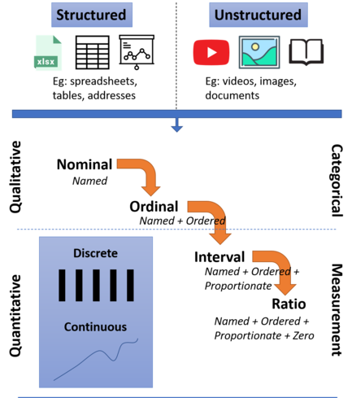
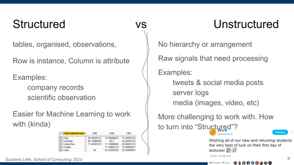
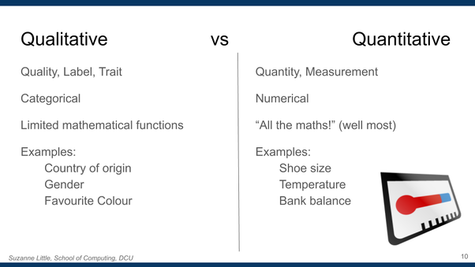
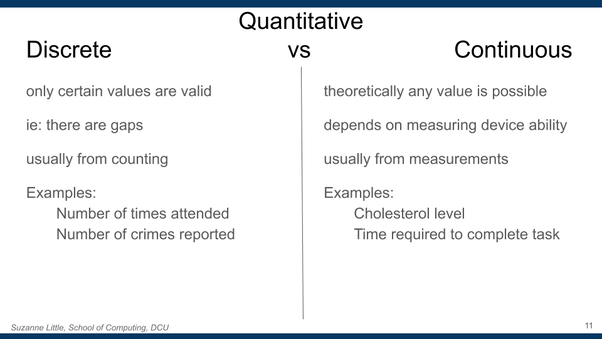
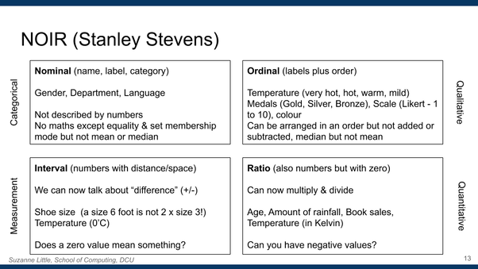

## Reference Sheet for Data Types

_Suzanne Little, suzanne.little@dcu.ie_&nbsp;

You may have seen data types before if you’ve built a relational database and specified the [SQL data types](https://www.w3schools.com/SQl/sql_datatypes.asp) or chosen the [column type](https://support.office.com/en-ie/article/data-types-in-data-models-e2388f62-6122-4e2b-bcad-053e3da9ba90) in a spreadsheet. These data types like string, integer, date etc. are very specific and normally determine the storage requirements, available operations and presentation format for the underlying data. 

Here we will look at four different ways of categorising data features plus a few special cases:

<!---->
- **[Structure vs Unstructured](#h.e3407nu8u4hm)**
- **[Quantitative vs Qualitative](#h.87zlj5fbe70q)**
- **[Discrete vs Continuous](#h.m33wx8n8gbho)**
- **[NOIR levels of data](#h.b5uofcsu8ws3)**
- **[Special types](#h.fdca96k0mzw7)** \- time, space, documents & media

Figure 1 below provides an overview of the relationship between these terms for talking about data. 

Why is this useful? The type of data in a dataset determines:

<!---->
- What statistics are possible/meaningful

- How data can be processed and/or stored

- Which machine learning model can be used

- Which visualisation method to use

**[References](#h.2mpjofdbj79k)**

### Structured vs Unstructured

When we look at where data comes from there are two categories that we can assign \- structured and unstructured. 

**Structured data**, as the name suggests, has been formatted into an orderly arrangement. This might be a table or tabular format like shown in Figure 1 below. Here we have rows or instances, one for each country and columns or attributes, one for each year. Simple tables like this are common from domains like company records or scientific observations. You can also find more complicated tables that are multi\-indexed. In the example here you might want a multi\-indexed table if you have more than one value to record for each year, for example, total salaried employees and median wage.

_Figure 1: Example of structured data in a spreadsheet_&nbsp;

The advantage of structured data is that it is generally easier for machine learning applications to work with. There are common storage formats that many tools are able to load, read and save and the data is normally cleaner \(Although we’ll learn later that this is not always the case\!\).

In contrast to structured data, we have **unstructured data**. Unstructured data has no hierarchy or arrangement and usually comes from raw signals that need to be processed in some way. Common examples of unstructured data include tweets \(See Figure 2\) and social media posts and multimedia data such as images, video and audio. Data sources like server logs and user interactions can also be unstructured though they do have some order. 

_Figure 2: Example of tweet_&nbsp;

Unstructured data is rich and challenging. The rise of the Internet, consumer digitisation devices, social media, mobile devices and wearable sensors \(like Fitbits\) mean that we are producing more data than ever before. Using unstructured data for analytics, machine learning or AI requires that the data is processed and converted into a usable format or structure. We’ll see later that unstructured data forms the basis for what is termed “big data” and the growth in opportunities to build data\-driven services. 

Deciding on whether a dataset or data source is structured or unstructured can depend somewhat on how you plan to use that data, do you want to analyse the _content_ of the tweets or just to _count_&nbsp;how many people liked it? When you approach a project, determining if you are working with primarily structured or unstructured data can help to estimate the amount of data processing work that could be required. 

### Quantitative vs Qualitative

These terms are often used because of their alliterative properties \(which make it hard for me to pronounce them\!\) but the distinction here is between labels \(strings\) that describe a quality and numbers that describe a quantity. 

**Qualitative data**&nbsp;is normally stored as text or a string and describes a label or trait of the instance. This is also called categorical data types. Some examples of qualitative features from a data set about this class might be the country of origin, gender, eye colour of each student. A key constraint of categorical data is that there are only limited mathematical functions you can perform, normally counting the occurrences and most popular. For example, you can’t calculate the average country of origin for this class\!

**Quantitative data** is numerical. These are features or attributes that give a measurement, generally stored as either an integer or real\-valued \(float\) number. Clearly this then allows mathematical operations to be performed on the values, though as you’ll see in the section on NOIR descriptions of data there are still limits on which operations should be used for numbers. Some examples of quantitative features from a data set about this class might be height, shoe size or current bank balance. 

Understanding whether you have labels or measurements is useful when choosing the appropriate summary statistics for a dataset and to identify appropriate visualisation types.

**Discuss:** What about mobile phone numbers \-\- is this a quantitative value? Think about the type of maths operations you would perform on phone numbers. Is it a qualitative or quantitative feature?

### Discrete vs Continuous

Let’s talk about two qualities specific to numeric \(quantitative\) data \- discrete and continuous. You’ve probably seen these before in introductions to statistics.

Features that have **discrete** numeric data can only take certain values. This is commonly found when you count objects, for example, the number of students in a class, the number of times they attended. These objects can’t be divided so values like “100.5 students attended class” are not possible. 

The opposite of discrete data is **continuous**&nbsp;data. With features that have continuous numeric data theoretically any value is possible depending on the ability of your measuring device. Examples of continuous data might be measuring cholesterol level or the time required to complete a task. 

So a simple difference is that discrete data is counted while continuous data is measured. Again this is useful in selecting the appropriate statistical methods, machine learning models and suitable visualisation methods. 

### NOIR levels of data

The final way to categorise the type of data measurements comes from statistics and has four levels of classes for both qualitative \(categorical\) data and quantitative \(numerical\) data. 

The Nominal, Ordinal, Interval and Ratio classes of data measurement are particularly useful for identifying appropriate statistical methods and therefore the machine learning models that may be used for a dataset. Some of the labels are a little confusing but forming the habit of thinking about how you would class each attribute in your dataset will help you identify good analytics and visualisation methods and avoid the trap of performing an analysis or visualisation that is false or misleading.

**Nominal**&nbsp;

name, label, category \- not described by numbers \(though may be stored as numbers\)

Operations: Only equality and set membership. Can calculate mode but not mean or median.

Examples: Gender, Department, Language

**Ordinal**&nbsp;

Labels with a natural order

Operations: Can be arranged by order \(sorted\) but not added or subtracted, median can be calculated but not mean.

Examples: medals \(gold, silver, bronze\); scales \(Likert 1 to 10\) and temperature descriptions \(cold, warm, hot\)

**Interval**&nbsp;

Numbers with proportionate intervals. Negative values are possible and meaningful.

Operations: Can now use “difference between”, addition and subtraction operations and can calculate descriptive statistics. 

Examples: income, temperature \(°C, °F\) and shoe size.

**Ratio**&nbsp;

Numbers with proportionate intervals but the value of zero has meaning \(eg, “absolute zero”\) and therefore negative values are not possible. 

Operations: Can now multiple and divide. All statistical operations are possible.

Examples: age, amount of rainfall, book sales, temperature \(in Kelvin\!\)

#### Applying NOIR classifications to measurements

You don’t want to try and calculate the average of a list of people’s names or their average eye colour\! Other odd comparisons might be deciding that someone with a size 10 shoe has a foot that is twice as big as someone with a size 5 shoe. Shoe size is an _interval_ measurement because multiplication often doesn’t make sense. 

Temperature is an interesting case. When you use terms to describe the weather \(cold, cool, warm, hot\) then these are labels with a natural order so this measurement is _ordinal_. If you measure temperature using a standard system like Celcius or Farenheit then it is an _interval_&nbsp;measurement because the difference between 10 & 20 and 20 & 30 has the same meaning \(the interval is equivalent\). It’s also possible to have negative degrees Celsius and Fahrenheit so a value of zero does not mean that there is _no_ temperature. However, if you are using the Kelvin scale \(for example, in physics and chemistry\) then zero is a possible and meaningful value that means there is no physical heat\! This becomes a _ratio_&nbsp;measurement.

A few special cases that can be debated include [Likert scales](https://en.wikipedia.org/wiki/Likert_scale) and any measure that is a count of something. Likert scales refer to a type of survey question that uses a set of responses that are ordered so that one response is greater than another. For example, how are you enjoying this course? \(1 \- not at all to 5 \- it’s amazing\!\). A well designed and understood Likert scale set of responses has the same difference between each answer and so you could classify it as a numerical measurement and therefore as _interval_ data. However, they are often less precise and therefore work better as _ordinal_ \(ordered but not regular\) data. 

When you are counting something \- number of items, number of days, etc. this is generally a _ratio_ value because you can’t get a negative answer \(For example, I don’t own \-3 coffee mugs\) and because you can perform different descriptive statistics on the answers. However, counts can have their own statistical implications and you should refer to your courses on statistics and machine learning where necessary. 

### Special types of data

Now that we’ve looked at the main ways we can classify or discuss data such as structured or unstructured, qualitative or quantitative, discrete/continuous or NOIR, there are a few special cases that you need to watch out for. 

These data types often require specialised processing or provide the opportunity to use particular visualisation methods. We will discuss these below

**Temporal \(or Time Series\):** when reviewing or gathering a dataset that has timestamps, dates, or any other attribute that links with time you can look to techniques for time series analysis or consider options for viewing or processing continuous data. Where you are interested in behaviour or values over a period of time then the popular visualisation approach will be a line chart though we’ll talk about this in more detail in a later course in this program. 

**Geographic \(or Spatial\):** identifying a dataset attribute that has place names, GPS locations or any other spatial description can indicate that visualisation using a map, floorplan or graph is possible. Calculating the distance between spatial positions or plotting the route or trajectory may help to reveal extra information.

**Documents:** we will talk more about data and document formats later but if you have a data set that is a collection of structured or unstructured documents then you will likely need to do some further processing before the data can be used. This may include natural language processing or text analytics methods.

**Multimedia:** technically, multimedia are documents that include two or more types \(multi\) of media \(image, audio, video, 3D, etc.\). To use the knowledge in multimedia requires content\-based or semantic media analytics methods including computer vision, speech\-to\-text and artificial intelligence techniques to turn the signal \(e.g., audio, pixels, motion\) into meaningful labels \(bird, laughter, walking, etc.\). This is a specific and very exciting area of research \(coincidentally this is my area\!\). 

### References

“Types of Data”: Chapter 2 of “Principles of Data Science”, Sinan Ozdemir \(2016\), [DCU Library](https://dcu.primo.exlibrisgroup.com/permalink/353DCU_INST/jrp0g3/alma991005580550807206)

Good summary of NOIR for data measurements: [https://www.questionpro.com/blog/nominal\-ordinal\-interval\-ratio ](https://www.questionpro.com/blog/nominal-ordinal-interval-ratio/#targetText=Nominal%2C%20Ordinal%2C%20Interval%20and%20Ratio,being%20a%20multiple%20choice%20question.&targetText=Nominal%20scale%20is%20a%20naming,labeled%2C%20with%20no%20specific%20order.)

Nominal, ordinal, interval, & ratio data \(simple reference document\) [http://www.psy.gla.ac.uk/~steve/best/ordinal.html](http://www.psy.gla.ac.uk/~steve/best/ordinal.html) 

<!--

-->
