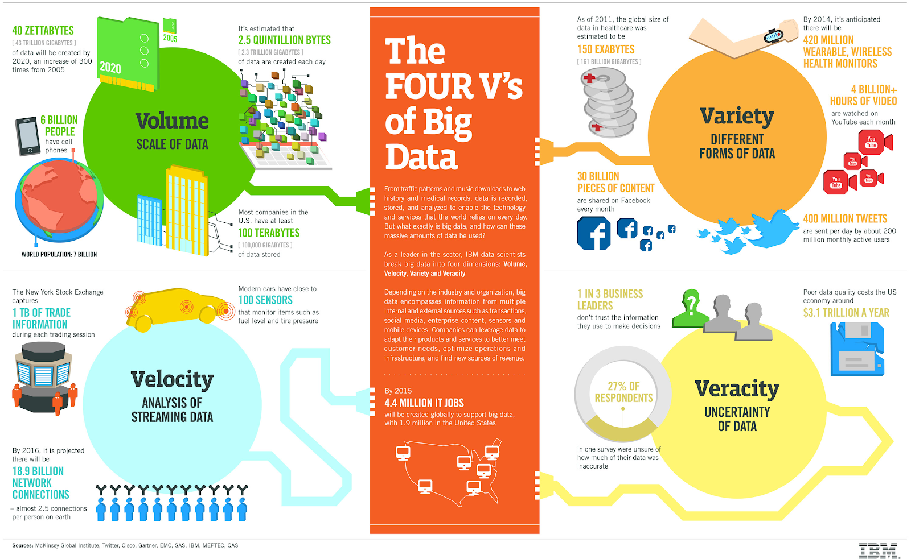
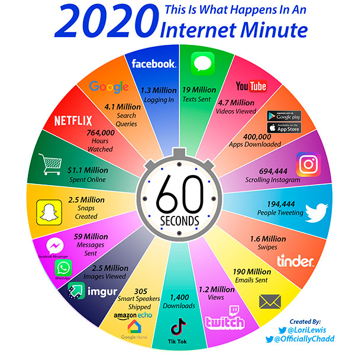

## Big Data

Suzanne Little, [suzanne.little@dcu.ie](mailto:suzanne.little@dcu.ie)

_[http://www.ibmbigdatahub.com/infographic/four\-vs\-big\-data](http://www.ibmbigdatahub.com/infographic/four-vs-big-data)_

Review the slides and video to see what qualifies as “big” data and to learn about the 3Vs \- Volume, Variety and Velocity \(optionally including Veracity\!\). Here we look at some sources and consequences of big data.

According to [Subrahmanyam, \(2008\)](https://www.sciencedirect.com/science/article/pii/S2214845019302650):

   &nbsp;&nbsp;&nbsp;_“First, there is human\-generated data via social media, and on various online forums, which can be analyzed using standard tools for text analysis. Second, there is process generated data, via the act of purchases and sales, such as credit card receipts, supermarket scanners and so on. Finally, there is machine\-generated data, such as tracking GPS movements of delivery trucks, and satellite\-based images of parking lots.”_&nbsp;

Here are three examples of activities or application domains that generate big data. Can you think of others?

### 1. The Internet Minute

Internet activity whether eCommerce, entertainment or social media is a rich source of data that is high volume, high velocity and high variety. The graphic below shows some of the activity that occurs each minute \(24 hours a day\!\) in 2020. Can you find some of the graphics from earlier years and see what services have changed?

_What happens in an Internet minute \[[Source](https://www.allaccess.com/merge/archive/31294/infographic-what-happens-in-an-int)\]_&nbsp;

### 2. Instrumented Vehicles

YouTube has 500 hours of video uploaded per minute according to [Tubefilter](https://www.tubefilter.com/2019/05/07/number-hours-video-uploaded-to-youtube-per-minute/). This ranges from cat videos to twitch streams to tutorials to original content, trailers and music videos. This is a clear example of “big data”, high volume \(new content is added 24/7\), high velocity \(that’s over 3 **years** worth of video each hour\!\) and high variety. 

A source of big data that you may not have considered is the transport you use. Instrumented vehicles are used to develop advanced driver assistance and safety systems \(Zhu et al, 2019\). These cars have 6\-10 cameras, radar and/or lidar sensors, accelerometers, pressure sensors and other engine sensors. When a car is sent out to record a scenario \(such as a highway driving at varying light levels\) then high quality video is recorded and between 10\-50TB of data is captured per vehicle per day of operation \(that is an eight hour window\). This is normally high\-definition video that then needs to be annotated in exhaustive detail.  

_Instrumented vehicle as part of the EU H2020 VI\-DAS project, \[[Source](http://vi-das.eu)\]_&nbsp;

Similarly a [2016 survey](https://www.oliverwyman.com/our-expertise/insights/2016/apr/mro-survey-2016.html) predicted a massive increase in the amount of data generated from planes and some estimates say that a single jet engine can produce 30TB of data from a 30 minute flight. 

Data from transportation is clearly high volume, high velocity and also high variety. It can include numeric data from sensors, video, audio communications and other transaction data. 

### 3. The NY Stock Exchange 

Financial transactions, such as those on the [New York Stock Exchange](https://www.investopedia.com/terms/n/nyse.asp), where on average between one and [six billion shares are traded daily](https://www.investopedia.com/terms/n/nyse.asp), are also a common source of big data. The transaction data, volumes, prices, and timings all form a very large dataset. In addition researchers have tried to link share prices or activity with newspaper articles \(Tetlock, 2007\), tweets \(Si et al, 2013\), noise on the trading floor \(Cocal and Shumway, 2001\) and emotional levels in conference calls \(Mayew and Venkatachalam, 2012\). 

This data is particularly high velocity as trades occur continuously but also very high volume, and when combined with outside sources high variety as well. 

### Consequences?

Now that we’ve established that big data has high volume, high velocity and high variety, what does this mean for our ability to process big data and why would big data be useful? 

A simple method for evaluating if you are dealing with a big data set is to try and open the data using a personal computer system, say in a spreadsheet programme or even a text editor. If your system freezes with an error, crashes or is otherwise very slow to respond then you’ve likely reached the working memory limits of your programme. High volume data is generally **difficult or impossible to open in the memory available on a PC**. 

The high velocity of big data is usually seen in streaming data. That is, new data is constantly being generated and added to the current pile of information to be processed. Therefore programmes for reading or analysing the data need to be able to handle a dynamic data stack and should process the new information **fast enough to be able to use the conclusions**. 

Finally, the variety of big data creates some practical challenges. The analyst needs to consider **how to process different data formats** \(trades, tweets, images, audio recordings, lidar\), how to extract the relevant descriptions from this data \(often called feature engineering\) and then choose appropriate machine learning models that can handle multivariate data sets. 

There are ways to work around the data limits of standard programmes. Working in batches, filtering unneeded data entries using a different application or purchasing more memory are all effective workarounds. In addition, there are specific tools that aim to handle big data and we’ll look at some of these later in the course. 

**But what about the real\-world consequences of big data?**&nbsp;&nbsp;

Read [this article](https://theconversation.com/six-ways-and-counting-that-big-data-systems-are-harming-society-88660) that provides a counter\-narrative to the “promise of big data” articles and compare with statements from this overview of a 2013 [book on big data](http://www.big-data-book.com/on-the-book). 

Like many aspects of technology \(AI, Machine Learning, genetic testing, e\-finance\) there are positive and negative consequences to how we choose to use it. Consider the following statements about big data: 

<!---->
1. Big data allows us to make more personalised decisions like individualised health care and other customised solutions.

2. Big data lets us optimise many traditional processes to provide better services, more efficiently and with greater benefits.

3. “Privacy is harder to protect because the traditional legal and technical mechanisms don’t work well with big data.”

4. Big data is making us safer, smarter and better prepared for the future.

**Discuss:** Which statements do you agree with? What are your concerns about how big data might be used?

### References and further reading

Coval, J.D. and Shumway, T., 2001. Is sound just noise?. _The Journal of Finance_, 56\(5\), pp.1887\-1910.

Insights, S. and Insights, B., 2020. _Big Data: What It Is And Why It Matters_. \[online\] Sas.com. Available [here](https://www.sas.com/en_us/insights/big-data/what-is-big-data.html). 

Lee, C.H. and Yoon, H.J., 2017. Medical big data: promise and challenges. _Kidney research and clinical practice_, 36 \(1\), p.3.

Mayew, W.J. and Venkatachalam, M., 2012. The power of voice: Managerial affective states and future firm performance. _The Journal of Finance_, 67\(1\), pp.1\-43.

Si, J., Mukherjee, A., Liu, B., Li, Q., Li, H. and Deng, X., 2013, August. Exploiting topic based twitter sentiment for stock prediction. In _Proceedings of the 51st Annual Meeting of the Association for Computational Linguistics_ \(Volume 2: Short Papers\) \(pp. 24\-29\).

Subrahmanyam, A., 2019. Big data in finance: Evidence and challenges \*Borsa Istanbul Review\*, \*19\*\(4\), pp.283\-287. Available [here](https://www.sciencedirect.com/science/article/pii/S2214845019302650).

Tetlock, P.C., 2007. Giving content to investor sentiment: The role of media in the stock market. _The Journal of finance_, 62\(3\), pp.1139\-1168.

Zhu, L., Yu, F.R., Wang, Y., Ning, B. and Tang, T., 2018. Big data analytics in intelligent transportation systems: A survey. _IEEE Transactions on Intelligent Transportation Systems_, 20\(1\), pp.383\-398.

<!--

-->
