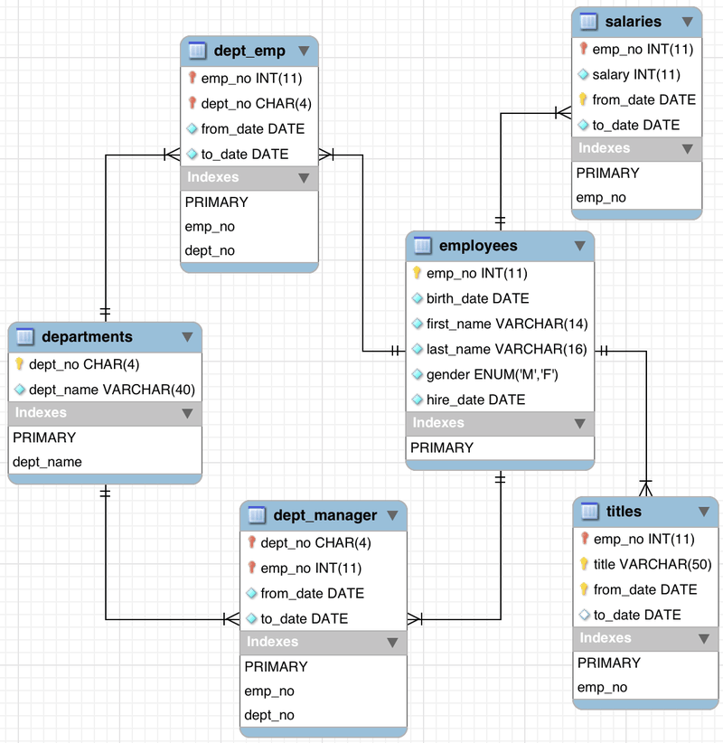
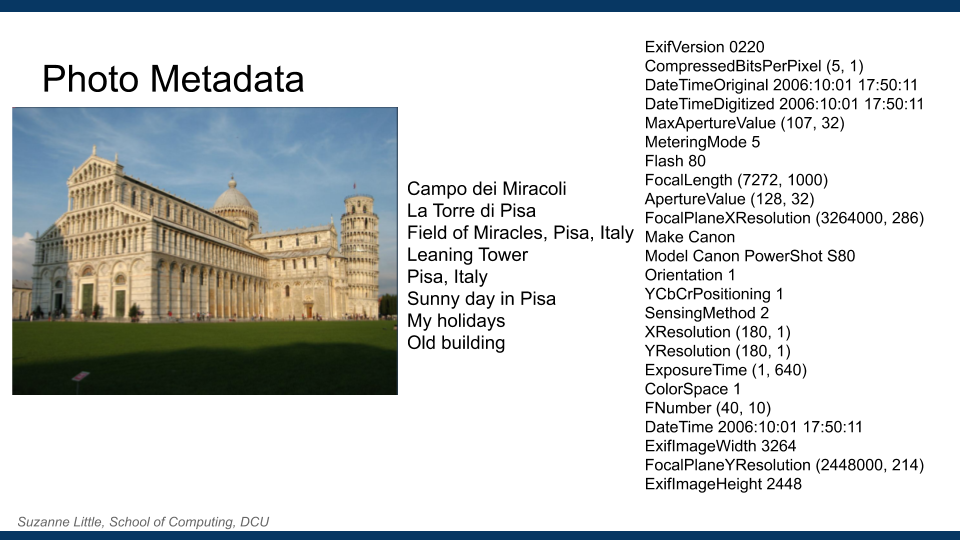
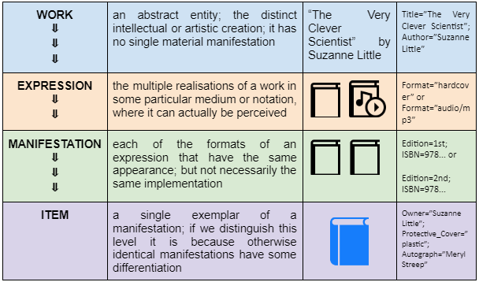
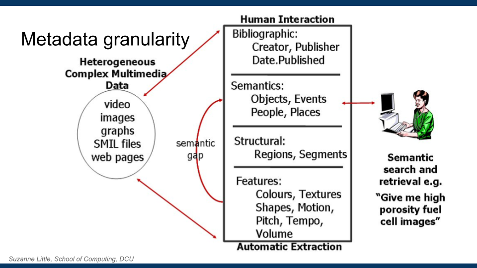

## Metadata

Suzanne Little, [suzanne.little@dcu.ie](mailto:suzanne.little@dcu.ie)

Metadata can be simply defined as **“data about data”**. It’s an important part of managing data in both the Data Gathering & Data Preserving phases in our generic pipeline. But what does metadata look like, how is it used and what are some of the challenges in creating useful metadata?

### What is it and why is it useful?

Let’s take a look at what we mean by “metadata” and why it might be useful. 

If you ask a librarian, they might tell you that metadata is an “inferior type of cataloging”\! However, in computing and data fields, metadata is “information about an object, be it physical or digital” that summarises the main qualities or attributes of the object. More formally, Baeza\-Yates \(1999\) in “Modern Information Retrieval” defines metadata as “information on the organization of the data, data domains, and the relationship between them”.

You’ve probably come across metadata before in schemas, data descriptions, specifications or catalogue data.

_Figure 1: Database schema_&nbsp;

Metadata is useful to help us to use data. Namely, metadata is used to:

<!---->
- Find 

- Locate 

- Identify 

- Select

- Obtain 

- Navigate

   &nbsp;&nbsp;&nbsp;

Importantly, metadata is also the place where information on rights management and privacy are often included.

There are different ways to think about metadata and explicit standards that you can use but it can be helpful to consider three different types of metadata:

| **Descriptive:** | what the information object is about; inherently intrinsic properties | 
| **Administrative:** | who,what,why,where of the object's creation and management; inherently extrinsic properties | 
| **Structural:** | information about the structure, format, and composition of the thing being described; can be intrinsic or extrinsic | 

Let’s take a look at examples of metadata for a complex digital object. Watch the YouTube video at [https://youtu.be/Ts\-eUudbyLo](https://youtu.be/Ts-eUudbyLo) which provides an explanation of photo metadata.

If you’d like to try extracting some EXIF from your own photos, there are various websites online that will do this. Or you can view the metadata fields using a photo editing tool like Adobe or GIMP or by right\-clicking on the image icon in Windows Explorer, choosing _Properties_ and then _Details_. 

**Exercise**: Take a photo using your mobile or find one online and view the associated metadata using either an [online EXIF tool](http://exif-viewer.com/) or viewing the file properties. Is there any information that surprises you or seems particularly useful? Can you identify descriptive, administrative or structural metadata?

Keep in mind the difference between _data_ and _metadata_. This is often an arbitrary distinction \(When does metadata become data itself?\). For this course, remember that metadata is the _names of the attributes_ \(author, date, title\) and not just the values \(“Suzanne Little”\). 

### Exercise: create your own metadata

Now that we know what metadata is and why it is useful. Try to create some metadata of your own. Follow the steps below and see what different aspects you think are important for using metadata.

<!---->
1. Describe your favourite book or movie.

2. What qualities or attributes did you use? Title, Author, Year, Genre, Characters, ... ? These qualities define the metadata.

3. How would you use your “metadata” to Find, Locate, Identify, Select, Obtain and/or Navigate a collection of books or movies?

I’ll refer back to this exercise later in this document so keep notes on your metadata example.

### Metadata Granularity

Metadata can apply to different dimensions or concepts:

   &nbsp;&nbsp;&nbsp;**Abstraction**: how close the metadata is to the data or object.

   &nbsp;&nbsp;&nbsp;**Granularity**: how detailed the metadata is.

Let’s discuss **abstraction**&nbsp;first.

Imagine you have written a novel. It’s wildly successful and a second edition is published plus an audiobook read by your favourite actor\! Your story is the _work_. It is your artistic creation without any specific manifestation. The published story \(the book\) is an _expression_. This is the medium \(channel\) that expresses your work. The different published versions of the book are _manifestations_ of this expression and the specific instance of the book \(the autographed copy you keep on your shelf\) is an _item_. The audiobook is a different example of an expression. In this case, there is one work with two expressions, one expression has two manifestations and there are many thousands of items. The table below describes this abstraction hierarchy using this example.

Why is it useful to think about the levels of abstraction of metadata? Well, particularly in examples like the one given here, you need to consider which level in the hierarchy you are describing when you assess the value and usability of the metadata. This is also true of other examples where you have a manifestation of a creative work or a digital copy of a created physical object. Does the description apply to the specific physical copy of the book or to all instances of the story? **Consider**: who is the “artist” if I take a photograph of a sculpture?

Abstraction is one way that metadata can be structured. When dealing with complex objects, especially digital representations of physical objects, you can see where there could be different ways of describing the data. Another way of thinking of this is the **granularity**&nbsp;of the metadata descriptions. 

Figure 1 below illustrates a granularity hierarchy that moves from very low\-level _features_&nbsp;describing the digital representation \(eg., things that can be calculated from the digital image pixels\) to slightly more complex _structure_&nbsp;feature descriptions that are calculated from these values. The next layer describes the meaning \(_semantics_\) that are represented in the digital object. The “semantic gap” refers to the difficulty in automatically \(i.e., without significant human effort\) creating the metadata that describes the meaning of a digital object. Finally, there is information that generally needs to be recorded by a human, _bibliographic_&nbsp;or management data about the creation and instance of the digital object. 

_Diagram showing metadata granularity_&nbsp;

### Metadata Standards

_“The wonderful thing about standards is that there are so many to choose from.”
_

\[This quote is most commonly attributed to Andrew S. Tanenbaum \(1981\) but also to Grace Hopper in The UNIX\-HATERS Handbook \(1994\).\]

You should now understand why metadata is useful \(reminder: to Find, Locate, Identify, Select, Obtain and/or Navigate your data and for rights management\) and you’ve made some metadata of your own at different levels of granularity and hierarchy.

If you haven’t done [the exercise ](#h.ech5aof3tolq) yet then go back and do it now. Take a look at the metadata you created. What terms did you use? Would everyone have described their book or movie in the same way?

This is where metadata standards are helpful. Standards can cause some problems \-\- perhaps it doesn’t include the information that you need or it’s just too big and complicated for your application. This is where the quote above is often used in many different subject areas\! 

A metadata standard provides the structure, syntax, vocabulary and/or format to specify your data. This enables a common understanding of the meaning and allows the attributes describing the data \(the metadata\) to be used and interpreted. 

**Discuss:** Can you suggest a problem if there are too many standards to choose from? What if every person in this class specified their own “metadata standard” for their student record? 

Metadata standards can be simple and specify basic administrative metadata \(see 1.4.2\) and the _syntax_&nbsp;for the metadata or they can be more comprehensive and include elements such as controlled vocabularies or ontologies that define the _semantics_. That is the meaning and relationships of the allowed values for the metadata. For example, a syntax specification may specify that a mandatory attribute of the data is “Owner” with a value of type string but the semantic ontology could define “Owner” as a type of “Legal Entity”.

There are also numerous bodies that create and publish standards including ISO, RFC, IEEE and W3C. Metadata standards might be produced by organisations like the Research Data Alliance, the Digital Curation Centre or government bodies. There are often domain specific organisations that create metadata standards for very specific applications like geosciences, biomedical, cultural heritage and economics. 

To explore the many standards that are used, you can look at [https://www.dcc.ac.uk/guidance/standards/metadata/list](https://www.dcc.ac.uk/guidance/standards/metadata/list) or [https://en.wikipedia.org/wiki/Metadata\_standard\#Available\_metadata\_standards](https://en.wikipedia.org/wiki/Metadata_standard#Available_metadata_standards). 

Here I’ll discuss one of the most common, general standards: [Dublin Core](https://dublincore.org/). 

**Dublin Core**&nbsp;

Named after the location of the first workshop in Dublin \(Ohio not Dublin, Ireland\!\) Dublin Core is a small set of vocabulary terms \(DC\) that can be used to describe both digital and physical resources. The semantics of DC was established by an international, cross\-disciplinary group of professionals from librarianship, computer science, text encoding, the museum community, and other related fields and is endorsed as a standard by official bodies including IETF, ISO and NISO. It was proposed in 1995 as a standard set of metadata elements, simple enough to be supplied by the document's author rather than a professional curator. All 15 elements are quite abstract \(administrative in the hierarchy we discussed\) and all are optional to allow full flexibility. There are many syntaxes for how you record and store the Dublin Core records including in formats such as XML and RDF for machine readability. 

 * Title 
 * Identifier 
 * Subject 
 * Creator \(makes the content\)
 * Contributor 
 * Publisher 
 * Date 
 * Description 
 * Language 
 * Type \(the nature or genre\)
 * Rights 
 * Source \(if derived from another document or record\)
 * Relation 
 * Coverage 
 * Format 

You can find some simple examples for each element at [https://www.dublincore.org/specifications/dublin\-core/usageguide/2000\-07\-16/generic/](https://www.dublincore.org/specifications/dublin-core/usageguide/2000-07-16/generic/) . Some of the elements can be further refined. For example: Date.Created and Date.Modified. More complete documentation can be found at [https://www.dublincore.org/resources/userguide/creating\_metadata/](https://www.dublincore.org/resources/userguide/creating_metadata/). 

**Exercise**: Go back to the metadata you created about your favourite book or movie. Can you make this metadata compliant with the Dublin Core standard. You’ll need to read the definitions and examples for the 15 elements. If I was to collect all the metadata records from the class, what functionality would be possible if you all use a standard?

**Further reading**&nbsp;

<!---->
- [Dataset Metadata Checklist \- Metadata \- UCF Research Guides at University of Central Florida Libraries](https://guides.ucf.edu/metadata/datasetmetadata_checklist)
- [Metadata \- Research Data Management \- LibGuides at National University of Ireland Galway](http://libguides.library.nuigalway.ie/researchdatamanagement/metadata)
- Research Data Alliance, [Metadata Standards Directory Working Group](http://rd-alliance.github.io/metadata-directory/)
- Digital Curation Centre, [Disciplinary Metadata \| DCC](https://www.dcc.ac.uk/guidance/standards/metadata)
- [What are Metadata Standards \| DCC](https://www.dcc.ac.uk/guidance/briefing-papers/standards-watch-papers/what-are-metadata-standards) 

### How is metadata created?

We’ve now established that having at least a simple standard can help metadata to be consistent and more useful for finding, understanding and sharing your data. 

But, where does metadata come from? In the last exercise you manually created metadata, using the Dublin Core standard, to describe a book or movie. This is an example of manually created, structured metadata where both the metadata attributes and their values are manually entered but there are other sources and methods for creating or capturing metadata. 

Let’s look at four general sources of metadata:

<!---->
1. Simple

   1. This is metadata that is often generated automatically during the creation of a digital object.

   2. Recall in the introduction to this topic, we looked at the embedded metadata in digital photographs.

   3. Eg, EXIF, document headers, time stamps

2. Structured

   1. This is metadata that adheres to a standard.

   2. It may also include manually entered data or conventions.

   3. Eg, Dublin Core.

3. Professional

   1. Librarians, Archivists, Curators are professional metadata creators\!

   2. They apply standards and are trained to create consistent, independent and high\-quality metadata.

   3. Eg, the Library of Congress [standards](https://www.loc.gov/standards/standard.html)

4. Crowd Sourced

   1. Social media content will have examples of simple and structured metadata associated with it but also crowd sourced labels. 

   2. These may gradually evolve into accepted standard labels from comments or hashtags. 

   3. Eg., hashtags, comments

These categories apply to all sorts of objects \-\- both physical and digital \-\- but what if we consider just datasets? Take a look at these guidelines for creating appropriate metadata to describe a dataset from the University of Central Florida \(who have also published a number of [datasets for computer vision](https://www.crcv.ucf.edu/data/)\) \- [Dataset MetaVdata Checklist \- Metadata \- UCF Research Guides at University of Central Florida Libraries](https://guides.ucf.edu/metadata/datasetmetadata_checklist). Note that many funding agencies will require you to publish a dataset that is created from public funds so understanding the metadata requirements is important. 

**Discuss**: take a look at the recommendations for [creating dataset metadata](https://guides.ucf.edu/metadata/datasetmetadata_checklist) and under point 4, can you recognise the concepts that we have discussed? Are there any suggested metadata attributes that surprise you? Think back to the dataset you looked at from data.gov. Did it have useful and informative metadata?

Hopefully you are starting to realise that creating high\-quality metadata can be _expensive_, _time\-consuming_ and _difficult_. There are some attributes that can be automatically populated but there is still manual work and decisions about the _scope_ and _scale_ of required metadata. 

**So how much metadata do we need?**&nbsp;

It’s important to consider the tradeoffs between:

<!---->
- organisation \(adding, duplicate detection, storage\) and

- retrieval \(query, search\).

You want to be able to fulfill the main requirements for your data or object \-\- to Find, Locate, Identify, Select, Obtain and/or Navigate \-\- but not all documents and resources need the same amount of metadata. The principal question to ask is: could someone else understand and use your dataset?

### Problems & Challenges

So far I’ve been very positive and encouraging about metadata, its usefulness and importance, especially for digital datasets and objects. However there are problems and challenges with metadata both in the effort and complication of trying to establish what and how much should be recorded and also in trying to enforce a metadata standard where the information is provided by a variety of other people. 

Read this 2001 article by author [Cory Doctorow](https://en.wikipedia.org/wiki/Cory_Doctorow) “[Metacrap: Putting the torch to seven straw\-men of the meta\-utopia](https://people.well.com/user/doctorow/metacrap.htm)”. 

In 2001 there was a particular push for exhaustive, high\-quality, machine\-readable metadata in the belief that it would create enormous opportunities for new services. In the article, Doctorow looks at seven obstacles that prevent this “meta\-utopia”:

<!---->
1. People lie 

2. People are lazy 

3. People are stupid 

4. People delude themselves 

5. Schemas aren’t neutral

6. Metrics distort or limit

7. There’s more than one way\!

Some of these ideas will come up again when we look at data cleaning, as metadata created by humans can exhibit a lot of inconsistencies and errors. 

**Consider**: After reading the article do you feel that metadata is no longer useful or important? Do you agree with Doctorow’s views on human behaviour? You may find it interesting to look at Doctorow’s background and other activities.

### References

Baeza\-Yates, R. and Ribeiro\-Neto, B., 1999. \*_Modern information retrieval\*_ \(Vol. 463\). New York: ACM press, Addison Wesley.

Gill, T., Gilliland, A.J., Whalen, M. and Woodley, M.S., 2008. \*_Introduction to metadata\*_. Getty Publications. \(Only the chapters on “Metadata and the Web” and “Practical Principals for Metadata Creation and Maintenance”\). Available [here](http://www.getty.edu/research/publications/electronic_publications/intrometadata/index.html).

Glushko, B., 2006. 5. \*Metadata and Metadata Standards\*. Available [here](http://courses.ischool.berkeley.edu/i202/f08/lectures/202-20080917.pdf). 

<!--

-->
