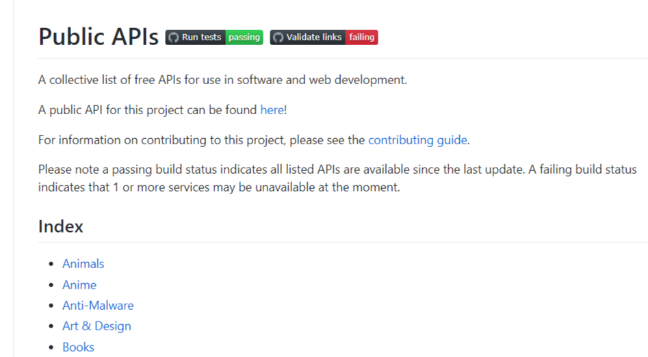
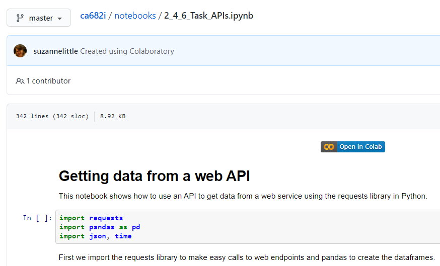

## Getting data from APIs

Not all data can be simply downloaded via a link to a file. Sometimes we need to query an online database or data storage application. This is an example of using an API \(Application Programming Interface\) to send commands to a programme and get a response, often a data fragment, in reply. 

REST \(REpresentational State Transfer\) is a particular type of API that has become more common in recent years. You may have also heard of SOAP \(Simple Object Access Protocol\), which is a more powerful and consequently more complex standard for defining and implementing programming interfaces that can be accessed via web services. 

Another common acronym that you’ll come across is JSON \(JavaScript Object Notation\). This data format is commonly used when returning results from REST calls. 

To get an overview of the main concepts behind APIs and REST check out this [article](https://blog.hubspot.com/website/application-programming-interface-api). To get a simplified discussion on the concepts behind REST, check out this [article](https://www.infoq.com/articles/rest-introduction/). 

Watch [this video](https://www.youtube.com/watch?v=7YcW25PHnAA) to give an introduction to REST APIs and some examples of how they can be used. Note that some of the example services are no longer available or may require an account. 

REST APIs can be very useful ways to get the latest data from web sites or social media. The advantage of using APIs like this is that the call for data can be dynamic and embedded into a programme or data pipeline using common languages such as python, javascript or R. 

**Consider**: Can you think of some advantages and disadvantages of providing or accessing data via an online REST API?

### Exercise

APIs for data access can be quite sophisticated. Here we will try a few simple options.

Firstly note that many APIs will require some kind of key or other authentication. This stops the server from being abused by many requests for data so check the terms and conditions when you request a key.

You can use programming libraries like [curl](https://en.wikipedia.org/wiki/CURL) or [requests](https://requests.readthedocs.io/en/master/) in python to make REST calls by creating the appropriate URL string. To fully explore or to develop REST apis an interface or browser plugin like [postman](https://www.postman.com/), [paw](https://paw.cloud/) \(Mac\) or [Advanced REST client](https://install.advancedrestclient.com/install) can be used. Here we will use a Colab notebook.

The aim of this notebook is to try some simple calls to APIs using programming libraries.

Open [this notebook](https://github.com/suzannelittle/ca682i/blob/master/notebooks/2_4_6_Task_APIs.ipynb) in Colab and don’t forget to save a copy of the notebook to your own account to work on it. 

Further information on APIs and how they work can be found [here](https://technologyadvice.com/blog/information-technology/how-to-use-an-api/). 

Like to try some more APIs? Check out the [Big List of Public APIs](https://github.com/public-apis/public-apis) on github. Note that many of these will require registering for an access key and not all APIs are for accessing data.

<!--

-->
